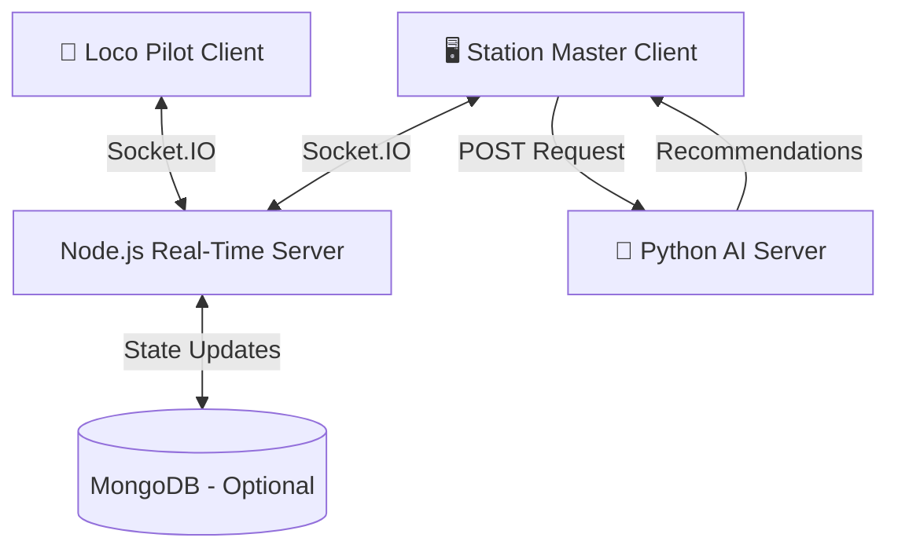

# 🚂 Chanakya : Real-Time Digital Twin for Railway Logistics with AI Optimization

[](https://railway-simulation.vercel.app)
[](https://railway-simulation.onrender.com)
[](https://railway-ai-brain.onrender.com)
[](LICENSE)

> An advanced **Digital Twin simulation** for railway networks — combining real-time synchronization, cloud-native microservices, and a **Reinforcement Learning (RL)** agent to optimize traffic flow and prevent collisions.

---

## 📖 Overview

This project simulates a complex railway network in real-time, acting as a decision-support system for logistics management. It creates a live feedback loop between three roles:

| Role | Interface | Responsibility |
|------|-----------|----------------|
| 🖥️ **Station Master** | Web Dashboard | Oversees the global network map and acts on AI recommendations |
| 📱 **Loco Pilot** | Mobile Dashboard | Drives specific trains, controls speed, triggers emergency stops |
| 🤖 **AI Advisor** | Cloud-hosted Neural Net | Analyzes simulation state and suggests optimal routing to minimize delays |

---

## ✨ Key Features

- **⚡ Real-Time Synchronization** — Socket.IO keeps train positions, signals, and alerts in sync across all connected devices with **<50ms latency**.
- **🖥️ Dual-Interface System** — A full-featured Station Master dashboard alongside a focused, mobile-optimized Loco Pilot view.
- **📡 Scalable Rooms Architecture** — Socket.IO Rooms ensure Loco Pilots receive only targeted data packets (unicast/multicast) rather than expensive global broadcasts.
- **🧠 AI-Powered Optimization** — A **PPO (Proximal Policy Optimization)** model trained with **Stable-Baselines3** provides live conflict-resolution recommendations.
- **🚨 Emergency Handling** — Real-time interrupt system lets drivers trigger emergency stops that instantly propagate to the control center.

---

## 🏗️ System Architecture

The project follows a **microservices-inspired, event-driven** architecture across three independently deployed services:



| Layer | Technology | Hosting |
|-------|------------|---------|
| **Frontend** | Vanilla JS, HTML5, CSS3, SVG | Vercel |
| **Orchestrator** | Node.js + Express + Socket.IO | Render |
| **AI Engine** | Python + Flask + PyTorch | Render |

---

## 🛠️ Tech Stack

<details>
<summary><strong>Frontend</strong></summary>

- **Languages:** HTML5, CSS3, JavaScript (ES6+)
- **Visualization:** Custom SVG Mapping, DOM Manipulation
- **Hosting:** Vercel

</details>

<details>
<summary><strong>Backend (Real-Time Orchestrator)</strong></summary>

- **Runtime:** Node.js
- **Framework:** Express.js
- **Communication:** Socket.IO (WebSockets)
- **Hosting:** Render

</details>

<details>
<summary><strong>AI Engine</strong></summary>

- **Language:** Python 3.13
- **Framework:** Flask
- **ML Libraries:** PyTorch, Stable-Baselines3, NumPy, Gymnasium, Shimmy
- **Model:** PPO (Proximal Policy Optimization)
- **Hosting:** Render

</details>

---

## 🚀 Getting Started (Local Setup)

To run this project locally, you need to set up **three components** in separate terminals: the Client, the Node Server, and the AI Server.

### Prerequisites

- [Node.js](https://nodejs.org/) v18+
- [Python](https://www.python.org/) v3.10+
- Git

### 1. Clone the Repository

```bash
git clone https://github.com/iamanu26/railway-simulation.git
cd railway-simulation
```

### 2. Start the Backend (Node.js)

```bash
cd backend
npm install
node server.js
# Server runs on http://localhost:3000
```

### 3. Start the AI Engine (Python)

```bash
# Open a new terminal
cd python_ai
pip install -r requirements.txt
python app.py
# AI Server runs on http://localhost:5000
```

### 4. Run the Frontend

```bash
# Open a new terminal in the root folder
npx http-server .
```

> **Note:** For local testing, update the server URLs in `stationmaster.js` and `locopilot.js` to point to `localhost` instead of the Render deployment URLs.

---

## 🎮 Usage Guide

1. **Open the Web App** — Navigate to [https://railway-simulation.vercel.app](https://railway-simulation.vercel.app)

2. **Station Master Login**
   - Click **"Login as Station Master"**
   - The global network map loads — wait for trains to populate

3. **Loco Pilot Login**
   - Open the link on a second device or in a new browser tab
   - Click **"Login as Loco Pilot"**
   - Enter a Train ID (e.g., `12951`, `22440`)
   - Your train-specific dashboard appears

4. **Test the AI Advisor**
   - On the Station Master view, watch for **"AI Recommendations"** appearing when congestion is detected
   - Click **"Accept"** to apply the AI's suggested routing to the simulation

---

## 📂 Project Structure

```
railway-simulation/
├── backend/                # Node.js Server
│   ├── server.js           # Socket.IO event handling & game state logic
│   └── package.json
│
├── python_ai/              # AI Engine
│   ├── app.py              # Flask REST API
│   ├── railway_env.py      # Custom Gymnasium RL Environment
│   ├── model.pth           # Trained PPO model weights
│   └── requirements.txt    # Python dependencies
│
├── index.html              # Landing Page
├── station_master.html     # Station Master Dashboard
├── loco_pilot.html         # Loco Pilot Dashboard
├── stationmaster.js        # Station Master client logic
└── locopilot.js            # Loco Pilot client logic
```

---

## 🤝 Contributing

Contributions are welcome! To get started:

1. **Fork** the repository
2. **Create** your feature branch
   ```bash
   git checkout -b feature/AmazingFeature
   ```
3. **Commit** your changes
   ```bash
   git commit -m 'Add some AmazingFeature'
   ```
4. **Push** to the branch
   ```bash
   git push origin feature/AmazingFeature
   ```
5. **Open** a Pull Request

---

## 📄 License

Distributed under the MIT License. See [`LICENSE`](LICENSE) for more information.

---

<p align="center">
  Built with ❤️ by We.dev for smarter railway logistics
</p>
